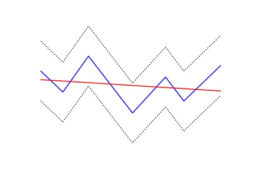
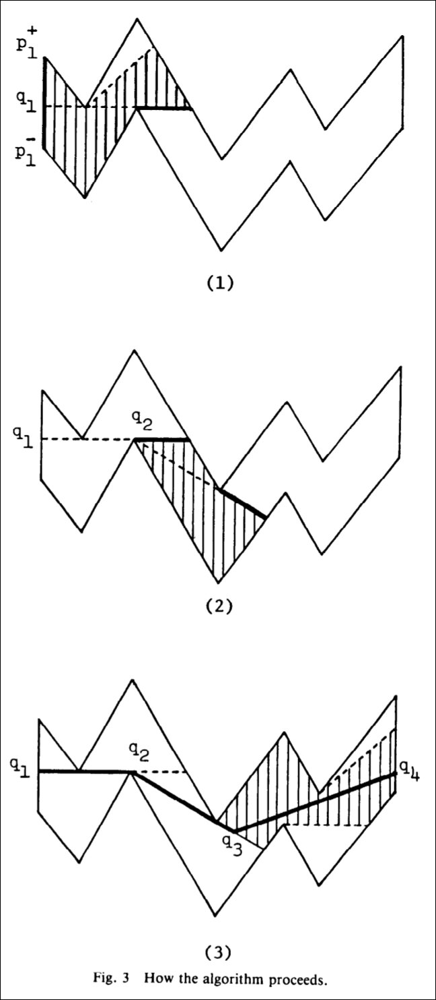

# Optimal polygon

Implementation of intuitive, simple and fast algorithm to construct piecewise linear functions based on Imai, Hiroshi, and Masao Iri. "An optimal algorithm for approximating a piecewise linear function." Journal of information processing 9.3 (1986): 159-162 [PDF from nii.ac.jp](https://ipsj.ixsq.nii.ac.jp/ej/index.php?action=pages_view_main&active_action=repository_action_common_download&item_id=59846&item_no=1&attribute_id=1&file_no=1&page_id=13&block_id=8).

Note, that optimal polygon can be used as a simple change detector or for any other application where piecewise linear model is applicable.

### Algorithm steps

In demo notebook you will find implementation of the same experiment which is supplied in original paper. 

